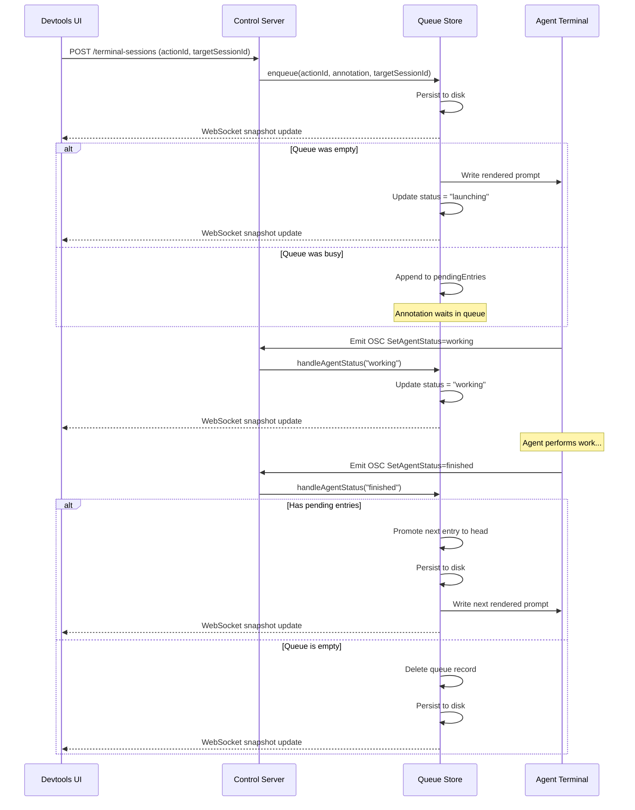

# Durable Annotation Queues

The annotation queue allows users to submit multiple agent annotations sequentially per routed service and annotation action without interrupting the agent's current work. The queue is strictly FIFO within each action-specific bucket, persisted to disk, and automatically drains based on terminal OSC status sequences. Generic command annotation actions start standalone terminals and do not use the durable queue.

## Architecture Flow

## How it works

### Queue Creation and Granularity

The queue is owned by the `devhost` control server (`internal/devtools/annotation_queue.go`) and is bucketed by the annotation action id plus the routed service identity (`host` + normalized `path`).

- If you submit an annotation targeting an existing agent session (e.g., via the "Append to active session queue" checkbox), it appends to that queue when the session belongs to the same routed service and the same annotation action id.
- If you submit a new untargeted agent annotation from the same routed service and action id, the control server reuses that bucket's existing queue when one already exists.
- If no queue exists for that routed service and action id yet, a new queue record is created and dispatched.
- If the selected annotation action has `kind = "command"`, the control server starts a standalone command terminal instead of enqueueing the annotation.

### Durability and Recovery

Every state transition (enqueue, finish, delete, edit, pause) is written to a JSON file in the `devhost` state directory **before** any action is taken. Persisted queue entries store the action id so recovery resumes the same agent action that originally received the annotation.
If you close your browser or completely restart `devhost`, the server automatically resumes the paused queues and replays the current "head" annotation into a fresh terminal session. It relies on at-least-once replay to ensure pending work is never lost.

### Automatic Draining via OSC Hooks

The core requirement is to avoid interrupting an agent while it is thinking.
The server actively parses the raw output stream of the pseudo-terminal (PTY) using an incremental parser (`internal/devtools/agent_status_osc.go`). It specifically listens for the terminal escape sequences:

- `OSC 1337;SetAgentStatus=working`
- `OSC 1337;SetAgentStatus=finished`

When the agent emits the `finished` hook, the server immediately promotes the next annotation in the queue to the head, removes the old one, and automatically dispatches the new prompt to the PTY. If the queue is empty, it safely deletes the queue record.

### Safety and Pausing

If a terminal unexpectedly exits or you forcefully close it before an annotation finishes:

- The queue enters a `paused` state.
- The UI exposes a "Resume" button that spins up a fresh terminal and re-dispatches the paused annotation.
- You are not permitted to edit an active "in-flight" annotation, but you can safely edit or delete any `queued` or `paused-active` entries directly from the UI.

### UI Integration

The UI panel (`AnnotationQueuePanel.tsx`) subscribes to a read-only WebSocket that pushes out full queue snapshots from the server whenever the state machine updates. The panel visualizes these queues locally, allowing you to track dispatch order, edit pending comments via authenticated HTTP `PATCH` requests, or `DELETE` pending jobs while the agent continues working undisturbed in the background.
