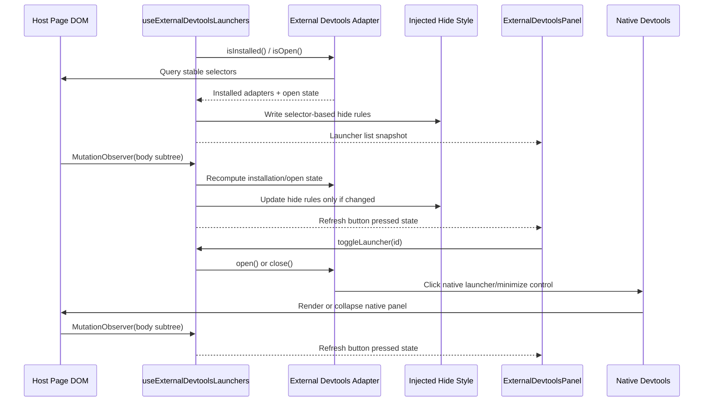

# External Devtools Launcher Aggregation

The external devtools feature aggregates supported third-party launcher buttons into the injected `devhost` overlay without taking ownership of the third-party panels themselves. It is intentionally conservative: `devhost` proxies launcher actions, hides the native launcher chrome, and lets the host library keep rendering and managing its own panel state.

## Architecture Flow

## How it works

### Adapter-Owned Host Knowledge

Each supported third-party tool is modeled as an `IExternalDevtoolsAdapter` in `src/devtools/features/externalDevtoolsPanel/externalDevtoolsDetectors.ts`.

- `isInstalled()` answers whether the host page appears to have mounted the tool.
- `isOpen()` answers whether the native panel is currently expanded.
- `open()` and `close()` proxy the tool's own launcher or minimize controls.
- `hideSelectors` lists the host selectors whose launcher chrome should be hidden while `devhost` is aggregating that tool.

This keeps host-specific selectors and behavior in one place instead of spreading them through the panel component or the hook.

### Selector-Based Suppression

The feature does **not** remove host-owned nodes or keep mutable references to specific launcher elements. Instead, `useExternalDevtoolsLaunchers.ts` writes a narrowly scoped `<style>` tag into `document.head` with `display: none !important` rules derived from the installed adapters.

That approach is more resilient than mutating individual nodes because it survives:

- React or library-driven DOM replacement
- launcher state transitions between collapsed and expanded modes
- repeated host re-renders that recreate the native launcher elements

The native panel DOM remains untouched and fully owned by the third-party library.

### Mutation Observation and Loop Prevention

Because these integrations depend on host-page DOM state, the hook observes `document.body` for subtree changes and recomputes the installed launchers whenever the host UI changes.

The observer intentionally avoids a full-document watch and batches recomputation behind `requestAnimationFrame`. The hide-style text is only rewritten when the selector set actually changes. Those guards prevent the injected feature from reacting to its own style updates and locking the page.

### UI Contract

`ExternalDevtoolsPanel.tsx` is only responsible for rendering the aggregated buttons and surfacing each launcher's current `isOpen` state.

- active buttons use the devtools primary button styling
- inactive buttons use the secondary styling
- button clicks always flow back through `toggleLauncher(id)` in the hook

This keeps the UI purely declarative while the adapters own the imperative host interactions.

### Safety Boundaries

The feature is deliberately scoped to launchers, not panels.

- `devhost` may hide supported native launcher controls
- `devhost` may proxy open/close interactions through the native controls
- `devhost` must not reparent, restyle wholesale, or otherwise assume ownership of the native panel contents

That boundary is what keeps the integration low-risk even when the host page includes multiple unrelated third-party toolbars.
