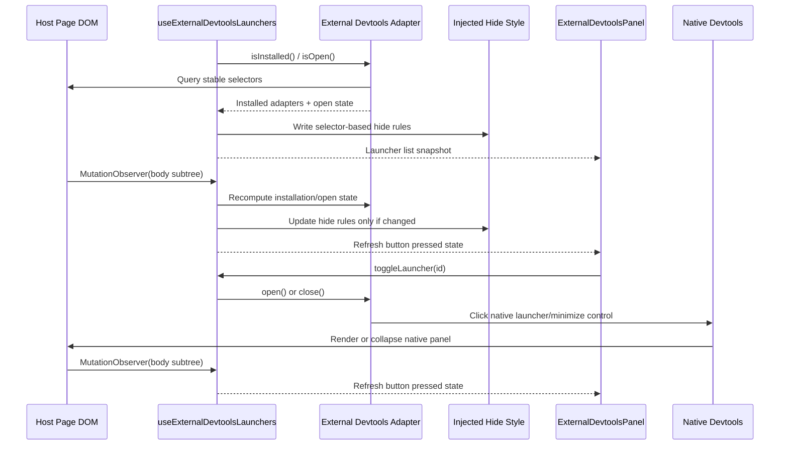

The external devtools feature aggregates supported third-party launcher buttons into the injected `devhost` overlay without taking ownership of the third-party panels themselves. It is intentionally conservative: `devhost` proxies launcher actions, hides the native launcher chrome, and lets the host library keep rendering and managing its own panel state.

## Architecture Flow



## How it works

### Adapter-Owned Host Knowledge

Each supported third-party tool is modeled as an `IExternalDevtoolsAdapter` under `src/devtools/features/externalDevtoolsPanel/`. `externalDevtoolsDetectors.ts` registers the Query and Router adapters; `createReactHookFormDevtoolsDetector.ts` discovers one adapter per mounted form inspector. The hook combines those adapters on every synchronization and resolves a launcher ID against the current adapters before dispatching an action.

- `isInstalled()` answers whether the host page appears to have mounted the tool.
- `isOpen()` answers whether the native panel is currently expanded.
- `open()` and `close()` proxy the tool's own launcher or minimize controls.
- `hideSelectors` lists the host selectors whose launcher chrome should be hidden while `devhost` is aggregating that tool.

This keeps host-specific selectors and behavior in one place instead of spreading them through the panel component or the hook.

### Selector-Based Suppression

The feature does **not** remove host-owned nodes or keep mutable references to specific launcher elements. Instead, `useExternalDevtoolsLaunchers.ts` writes a narrowly scoped `<style>` tag into `document.head` with `display: none !important` rules derived from the installed adapters.

That approach is more resilient than mutating individual nodes because it survives:

- React or library-driven DOM replacement
- launcher state transitions between collapsed and expanded modes
- repeated host re-renders that recreate the native launcher elements

The native panel DOM remains untouched and fully owned by the third-party library.

### Mutation Observation and Loop Prevention

Because these integrations depend on host-page DOM state, the hook observes `document.body` for subtree changes and recomputes the installed launchers whenever the host UI changes.

The observer intentionally avoids a full-document watch and batches recomputation behind `requestAnimationFrame`. The hide-style text is only rewritten when the selector set actually changes. Those guards prevent the injected feature from reacting to its own style updates and locking the page.

### UI Contract

`ExternalDevtoolsPanel.tsx` is only responsible for rendering the aggregated buttons and surfacing each launcher's current `isOpen` state.

- active buttons use the devtools primary button styling
- inactive buttons use the secondary styling
- button clicks always flow back through `toggleLauncher(id)` in the hook

This keeps the UI purely declarative while the adapters own the imperative host interactions.

### Safety Boundaries

The feature is deliberately scoped to launchers, not panels.

- `devhost` may hide supported native launcher controls
- `devhost` may proxy open/close interactions through the native controls
- `devhost` must not reparent, restyle wholesale, or otherwise assume ownership of the native panel contents

That boundary is what keeps the integration low-risk even when the host page includes multiple unrelated third-party toolbars.

## React Hook Form

The integration is browser-tested against `@hookform/devtools` **4.4.0** with `react-hook-form` **7.89.0**. The upstream panel stays in the host page; `devhost` supplies only its toolbar launcher. Other devtools versions and the React Hook Form browser extension are outside this tested integration.

### Host setup

Install `react-hook-form` and `@hookform/devtools` in your application, then mount the upstream `DevTool` with your form's `control`. Enable `[devtools.externalToolbars]` in `devhost.toml`:

```toml
[devtools.externalToolbars]
enabled = true
```

```tsx
import { DevTool } from "@hookform/devtools";
import { useForm } from "react-hook-form";

export function ProfileForm() {
  const { control, register } = useForm({
    mode: "onChange",
    defaultValues: { email: "" },
  });

  return (
    <>
      <form aria-label="Profile">
        <label>
          Email
          <input {...register("email", { required: "Email required" })} />
        </label>
      </form>
      <DevTool control={control} placement="top-right" />
    </>
  );
}
```

### Multiple inspectors and lifecycle

Each mounted inspector gets a separate **Form 1**, **Form 2**, and subsequent launcher, in the order its panel is first discovered by the active `devhost` hook. The number identifies that panel instance; it is not a form name or the upstream `DevTool`'s `id` prop, which upstream uses for its browser extension. Open an inspector to see which form's fields it contains. Choose different upstream `placement` values when mounting multiple inspectors so their native panels do not overlap.

Each launcher opens or closes only its associated inspector. Native close-button clicks update that launcher's pressed state. Panel identities are stored in a hook-local weak map without modifying host attributes or retaining native launcher elements. Actions re-query live panels by identity. Reordering existing panels preserves their numbers; replacing or remounting a panel assigns a fresh number, and a removed identity cannot target the replacement. Unmounting the `devhost` hook ends that numbering session.

The 4.4.0 panel remains mounted while collapsed. Detection requires its React Hook Form header, native close control, field filter, and field expansion control together. Opening clicks that panel's sibling logo SVG, where 4.4.0 installs its native handler; closing clicks its native close button. Only native open buttons containing the React Hook Form logo are suppressed. Close buttons, inspector contents, live field values, and validation remain under upstream ownership.

Disabling aggregation or unmounting `devhost` removes the suppression style and restores native launchers without changing inspector state. Remounted native buttons continue to match the suppression selector while aggregation is enabled. If the React Hook Form browser extension makes `DevTool` render no panel, `devhost` exposes no form launcher.

See the [upstream setup reference](https://github.com/react-hook-form/devtools#quickstart) and the pinned [panel lifecycle](https://github.com/react-hook-form/devtools/blob/0486f0e6dd73a203600fc00611aebb6ac79b6e07/src/devToolUI.tsx), [open handler](https://github.com/react-hook-form/devtools/blob/0486f0e6dd73a203600fc00611aebb6ac79b6e07/src/logo.tsx), and [close control](https://github.com/react-hook-form/devtools/blob/0486f0e6dd73a203600fc00611aebb6ac79b6e07/src/header.tsx).
