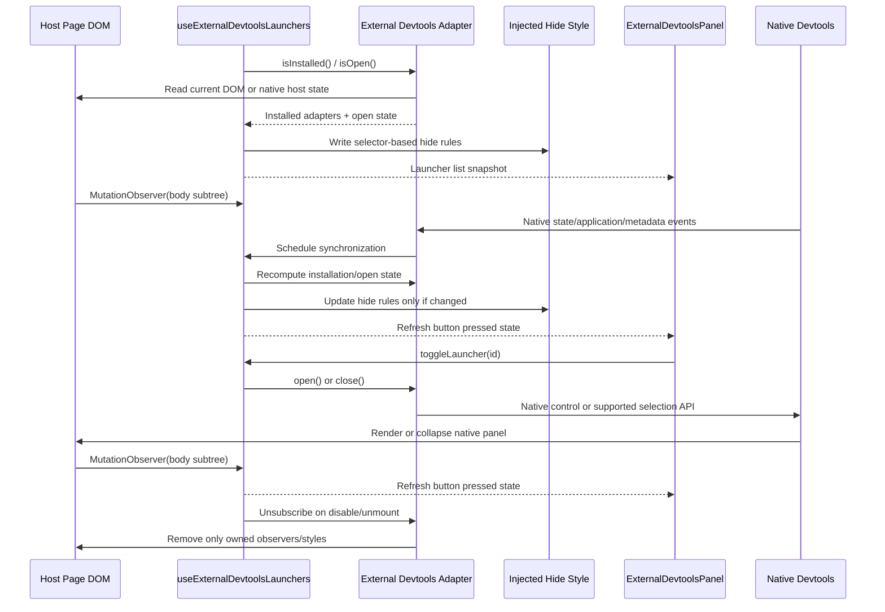

The external devtools feature aggregates supported third-party launcher buttons into the injected `devhost` overlay without taking ownership of the third-party panels themselves. It is intentionally conservative: `devhost` proxies launcher actions, hides the native launcher chrome, and lets the host library keep rendering and managing its own panel state.

## Architecture Flow



## How it works

### Adapter-Owned Host Knowledge

Each supported third-party tool is modeled as an `IExternalDevtoolsAdapter` under `src/devtools/features/externalDevtoolsPanel/`. `externalDevtoolsDetectors.ts` registers the Query, Router, and unified TanStack shell adapters; the Form and Jotai detectors discover one adapter per mounted native inspector. `createVueDevtoolsDetector.ts` observes the existing Vue/Vite host. `createExternalDevtoolsDetector.ts` combines current adapters and exposes an owned subscription/disposer to the generic hook. The hook resolves a launcher ID against current adapters before dispatching an action. Form/Jotai encounter identities remain local to the detector session across effect cleanup/re-subscription.

- `isInstalled()` answers whether the host page appears to have mounted the tool.
- `isOpen()` answers whether the native panel is currently expanded.
- `open()` and `close()` proxy native controls or supported native selection APIs.
- `hideSelectors` lists the host selectors whose launcher chrome should be hidden while `devhost` is aggregating that tool.

This keeps host-specific selectors and behavior in one place instead of spreading them through the panel component or the hook.

### Selector-Based Suppression

The feature does **not** remove host-owned nodes or keep mutable references to specific launcher elements. Instead, `useExternalDevtoolsLaunchers.ts` writes a narrowly scoped `<style>` tag into `document.head` with `display: none !important` rules derived from the installed adapters.

That approach is more resilient than mutating individual nodes because it survives:

- React or library-driven DOM replacement
- launcher state transitions between collapsed and expanded modes
- repeated host re-renders that recreate the native launcher elements

The native panel DOM remains untouched and fully owned by the third-party library.

Vue9's launcher is inside the upstream dock's open ShadowRoot, which a document stylesheet cannot reach. Its feature detector owns a constructed `CSSStyleSheet` adopted into that root. It targets only verified native dock-entry launcher markup with the unique current Vue entry title, covering floating and edge layouts. It does not hide the dock, panel, or iframe. Cleanup removes only that exact sheet from the current sheet list, preserving existing and later foreign sheets. See the native [adoptedStyleSheets contract](https://developer.mozilla.org/en-US/docs/Web/API/ShadowRoot/adoptedStyleSheets).

### Mutation Observation and Loop Prevention

Because these integrations depend on host-page DOM state, the hook observes `document.body` for subtree changes and recomputes the installed launchers whenever the host UI changes.

The observer intentionally avoids a full-document watch and batches recomputation behind `requestAnimationFrame`. It observes native open-state attributes, including the unified shell's `data-open`. The hide-style text is only rewritten when the selector set actually changes. Those guards prevent the injected feature from reacting to its own style updates and locking the page.

Body observation cannot see internal shadow-tree mutations. The Vue feature separately subscribes to published native panel, connection, trust, application, and existing dock shared-state events; it observes its native shadow roots for launcher replacement/title changes. Generation checks discard asynchronous responses after context replacement or cleanup. Disable, unmount, and React development StrictMode cleanup release these resources; re-enable and remount subscribe to the genuine current host again.

### UI Contract

`ExternalDevtoolsPanel.tsx` is only responsible for rendering the aggregated buttons and surfacing each launcher's current `isOpen` state.

- active buttons use the devtools primary button styling
- inactive buttons use the secondary styling
- button clicks always flow back through `toggleLauncher(id)` in the hook

This keeps the UI purely declarative while the adapters own the imperative host interactions.

### Safety Boundaries

The feature is deliberately scoped to launchers, not panels.

- `devhost` may hide supported native launcher controls
- `devhost` may proxy open/close interactions through the native controls
- `devhost` must not reparent, restyle wholesale, or otherwise assume ownership of the native panel contents

That boundary is what keeps the integration low-risk even when the host page includes multiple unrelated third-party toolbars.

## Vue DevTools

Devhost supplies one **Vue** launcher for the host-installed Vue DevTools inspector. Components, live component state, page selection, settings, and other Vite tools remain in the native host. Devhost does not install Vue instrumentation, mount an inspector, or replace the host's dock registration.

### Verified host setup

The supported combination is `vite-plugin-vue-devtools` **9.0.0-beta.1**, Vue **3.5.43**, Vite **8.3.3**, `@vitejs/plugin-vue` **6.0.9**, and `@vitejs/devtools` / `@vitejs/devtools-kit` **0.7.6**, resolving `@devframes/hub`, `@devframes/hub-ui`, and `devframe` **1.2.2**. Vue9 is a beta release whose native host and markup can change. Other versions, including stable plugin 8.2.1's different overlay, need their own verification; they are outside this integration. This host setup does not change devhost's repository Vite **7.3.1** or require unrelated applications to upgrade.

Install those packages in the Vue host and enable the genuine Vite DevTools host alongside the Vue plugin, following the [official Vue plugin setup](https://devtools.vuejs.org/guide/vite-plugin):

```js
import { defineConfig } from "vite";
import vue from "@vitejs/plugin-vue";
import vueDevTools from "vite-plugin-vue-devtools";

export default defineConfig({
  plugins: [vue(), vueDevTools()],
  devtools: { apply: "serve" },
});
```

Enable `[devtools.externalToolbars].enabled = true` in `devhost.toml`. Reveal a passive/hidden native host with **Alt+Shift+D**, select its **Unauthorized** control, and enter the actual code printed by the host. Devhost does not bypass authorization. The **Vue** entry appears only after native trust, a visible embedded dock, a registered Vue iframe entry, and a real mounted Vue application are present. Merely installing Vite tools or loading their dock on an unrelated non-Vue page does not qualify.

### Native state, ownership, and cleanup

The detector uses published `getDevframeClientContext()` from `@devframes/hub/client`, the getter used by the verified host. Kit 0.7.6's `getDevToolsClientContext()` reads a different global and returns undefined in this host; devhost supplies no alias or fabricated context. Vue's existing runtime kit supplies application snapshots and lifecycle events. Devhost reads these objects without installing or disposing the host's kit or hooks.

Open and close call native `docks.switchEntry("vue-devtools")` and `docks.switchEntry(null)`. Pressed state requires native panel state **open** and selected dock **vue-devtools**. Native Escape, selecting another tool, hiding/revealing the dock, and page component selection update that state through native events. Starting the page locator temporarily closes Vue; selecting the real page component restores the native inspector and toolbar state.

The Vue launcher suppression sheet follows current entry title, native root replacement, and floating/edge layout changes. Server metadata replacement, field removal, entry removal/re-registration, client overrides, and later forced client registration remain upstream-owned. Cleanup restores native launcher visibility without reverting metadata, disposing registrations, changing the selected panel, or removing foreign sheets. Native Settings remains usable. Disabling/remounting devhost and StrictMode effect cleanup/re-subscription preserve these contracts and recover live inspection.

The title must be unique among native dock entries for the verified launcher selector to identify Vue. A collision suppresses neither launcher and removes the aggregate Vue entry; a later unique title restores availability. Native `when`/`visibility` conditions, hidden dock state, missing roots, revoked trust, or application unmount likewise remove availability and the owned sheet. Recovery is observed from the real host. The button's title reports the native connection status; it is not inferred from iframe presence.

Shared-state observation starts only when the host is trusted and `devframe:docks` already exists in its published cache. In devframe 1.2.2, requesting a missing state before authorization creates a deferred state object; initializing a competing object can leave the native UI holding stale metadata. Devhost never initializes that registry, overrides native listeners, or claims host registration ownership. Async subscriptions and application queries carry generation checks so cleanup cannot install a late listener or sheet.

### Project and delivery boundaries

Native browser regressions verify actual Components/live state/page selection, normal/passive/hidden hosts, unrelated pages, application mount/unmount, metadata replacement, title collision/recovery, native root/layout replacement, foreign sheets, and devhost disable/unmount/remount. Independent host servers on separate origins, including a `/project-b/` Vite base, preserve separate state and launcher selection. Use separate public project origins: the upstream host keeps geometry in origin local storage and selection in tab session storage; devhost does not rewrite upstream channels or preferences.

The supported integration is the attached embedded host. Devhost does not control detached documents or advertise a standalone-only host as attached. Runtime state and resources stay local to the host document and active detector; no global project port or browser session is shared by devhost's detector.

Compiled-bundle validation also verifies two simultaneously running devhost projects through separate public HTTP/HTTPS hostnames, including the Vite base path, native authorization, live Components state, and independent selection with `proxyLocalOrigin = true`. The fixture's manually rendered toolbar is removed for that check. The isolated validation Caddy uses supported test-only `skip_install_trust`, `http_port`, and `https_port` globals and a private browser that accepts its untrusted certificate. This proves native routing, injection, and inspection; it does not verify unmodified managed CA trust installation. No test override changes the app generator or the Vue host contract.

Published native contracts are pinned in [Vue's host client and instrumentation](https://github.com/vuejs/devtools/blob/e69a502d2a800da79ded86cb9847b2bcb922aec5/packages/vite/src/client.ts), [hub getter](https://github.com/devframes/devframe/blob/56caf88d5498e60b46904441d20d28b533886d99/packages/hub/src/client/context.ts), [dock APIs](https://github.com/devframes/devframe/blob/56caf88d5498e60b46904441d20d28b533886d99/packages/hub/src/client/docks.ts), and [native launcher markup](https://github.com/devframes/devframe/blob/56caf88d5498e60b46904441d20d28b533886d99/packages/hub-ui/src/client/components/dock/DockEntry.vue).

## Unified TanStack shell

Mount the upstream `TanStackDevtools` in the host application and enable `[devtools.externalToolbars].enabled = true`. Devhost supplies one **TanStack** launcher for the attached native shell. Plugin navigation, live inspection, layout, and actions stay inside TanStack's workspace. Standalone Query and Router panels retain their separate toolbar entries; their plugins inside the unified shell do not create duplicate entries.

### Tested versions and host setup

The browser integration is verified in a development runtime with React/React DOM **19.2.5** and the following exact packages. [TanStack Devtools is alpha](https://tanstack.com/devtools/latest/docs/overview); its API and DOM contract can change between releases. Other releases require verification.

| Tool  | Host library                      | Devtools package                                                                  |
| ----- | --------------------------------- | --------------------------------------------------------------------------------- |
| Shell | —                                 | `@tanstack/react-devtools` **0.10.13** (`@tanstack/devtools` **0.15.0**)          |
| Form  | `@tanstack/react-form` **1.33.5** | `@tanstack/react-form-devtools` **0.2.34**                                        |
| Table | `@tanstack/react-table` **9.2.6** | `@tanstack/react-table-devtools` **9.2.5**                                        |
| Pacer | `@tanstack/pacer` **0.23.1**      | `@tanstack/react-pacer-devtools` **0.9.1** (`@tanstack/pacer-devtools` **1.6.0**) |

Install those packages in the host application. Use the native plugin factories with a stable plugin list:

```tsx
import { TanStackDevtools } from "@tanstack/react-devtools";
import { formDevtoolsPlugin } from "@tanstack/react-form-devtools";
import { tableDevtoolsPlugin } from "@tanstack/react-table-devtools";
import { pacerDevtoolsPlugin } from "@tanstack/react-pacer-devtools";
import { useState } from "react";

export function AppDevtools() {
  const [plugins] = useState(() => [formDevtoolsPlugin(), tableDevtoolsPlugin(), pacerDevtoolsPlugin()]);
  return <TanStackDevtools plugins={plugins} />;
}
```

Configure instrumentation in the application's real libraries:

- [Form](https://tanstack.com/form/latest/docs/framework/react/guides/devtools): create the form with `useForm({ formId: "profile", defaultValues: { name: "" } })` and use its native field handlers. The inspector receives actual form updates.
- [Table](https://tanstack.com/table/latest/docs/devtools): create a v9 table with `useTable`, native `tableFeatures`, and a unique `key`; call `useTanStackTableDevtools(table)`. The tested fixture uses `rowSelectionFeature` and verifies live selected rows in both native state views. The v8 `useReactTable` API is outside this tested setup.
- [Pacer](https://tanstack.com/pacer/latest/docs/devtools): create a keyed native utility, such as `new Debouncer(callback, { key: "save-profile", wait: 5000 })`, and call `maybeExecute` from application interactions. Native **Flush** executes that callback. Call `cancel()` during the application's unmount cleanup to stop pending work.

Devhost does not install host plugins, instrument libraries, replace native actions, or create a server connection for this integration. The tested shell uses its default browser event bus.

### Native controls and lifecycle

Discovery requires an attached native root containing both its persistent panel and native open trigger. A collapsed panel remains mounted; devhost reads its `data-open` state rather than treating presence as open. Toolbar actions re-query current roots and click native open/close controls. Native Escape, hotkeys, settings changes, and host remounts update toolbar availability and pressed state through DOM observation.

Only the shell's native opening and closing chrome is suppressed while aggregation is enabled. Plugin close buttons, controls, and content remain available. Disabling aggregation or unmounting devhost removes the suppression style and restores native chrome without changing panel state. Replacement triggers are suppressed while aggregation remains enabled.

URL-gated shells without the required flag and shells with `triggerHidden` have no toolbar entry. The native hotkey still opens a hidden-trigger shell; enabling its trigger through native Settings makes it available to devhost. TanStack's `config` initializes preferences; saved native settings take precedence on later mounts.

Multiple attached shells on the same page share upstream events and preferences. One **TanStack** entry reports whether an attached shell is open and proxies the upstream shared toggle; it does not assign independent shell identities. Same-origin tabs also share the upstream channel and local-storage preferences. Use separate project origins for separation: real browser tests verify that opening a shell on `127.0.0.1` leaves the shell on `localhost` closed. Devhost does not rewrite upstream channels or storage.

Native **Detach** moves the shell into TanStack's popup window. The parent-page toolbar entry disappears while the shell is detached because the native parent controls are absent. Close the popup to return the shell to its host page; devhost rediscovers it and reports its native open state. Devhost does not proxy controls into detached documents.

### Plugin and environment boundaries

Form 1.33.5 publishes updates when form state changes. A Form pane mounted after the form can be empty until the next field update; remounting that pane can repeat this boundary. Table registers its keyed instance when the devtools hook mounts. Form and Table remove their registrations when the host library components unmount.

Pacer 0.23.1 retains keyed utilities in its native registry and exposes no unregister/dispose API. Application cleanup cancels pending work, but the native inspector can retain an idle utility after host unmount. Devhost does not delete registry entries or synthesize lifecycle events.

These packages use `NODE_ENV=development` for their native event clients and default devtools panels. A `test` runtime intentionally selects native no-ops. This repository's Storybook browser checks run `NODE_ENV=development bun vitest run -c vitest.storybook.config.ts`; setting Vite's mode alone does not select that runtime. See [Vite's environment and mode distinction](https://vite.dev/guide/env-and-mode#node-env-and-modes).

Production opt-in is outside this tested integration. In Pacer devtools 0.9.1, the public React `/production` entry still imports the base core, which selects a no-op outside development; the test-mode browser probe confirms that no Pacer pane appears. Do not treat that entry as verified production support. Follow each upstream package's bundling guidance and verify any production use independently.

## React Hook Form

The integration is browser-tested against `@hookform/devtools` **4.4.0** with `react-hook-form` **7.89.0**. The upstream panel stays in the host page; `devhost` supplies only its toolbar launcher. Other devtools versions and the React Hook Form browser extension are outside this tested integration.

### Host setup

Install `react-hook-form` and `@hookform/devtools` in your application, then mount the upstream `DevTool` with your form's `control`. Enable `[devtools.externalToolbars]` in `devhost.toml`:

```toml
[devtools.externalToolbars]
enabled = true
```

```tsx
import { DevTool } from "@hookform/devtools";
import { useForm } from "react-hook-form";

export function ProfileForm() {
  const { control, register } = useForm({
    mode: "onChange",
    defaultValues: { email: "" },
  });

  return (
    <>
      <form aria-label="Profile">
        <label>
          Email
          <input {...register("email", { required: "Email required" })} />
        </label>
      </form>
      <DevTool control={control} placement="top-right" />
    </>
  );
}
```

### Multiple inspectors and lifecycle

Each mounted inspector gets a separate **Form 1**, **Form 2**, and subsequent launcher, in the order its panel is first discovered by the active `devhost` hook. The number identifies that panel instance; it is not a form name or the upstream `DevTool`'s `id` prop, which upstream uses for its browser extension. Open an inspector to see which form's fields it contains. Choose different upstream `placement` values when mounting multiple inspectors so their native panels do not overlap.

Each launcher opens or closes only its associated inspector. Native close-button clicks update that launcher's pressed state. Panel identities are stored in a hook-local weak map without modifying host attributes or retaining native launcher elements. Actions re-query live panels by identity. Reordering existing panels preserves their numbers; replacing or remounting a panel assigns a fresh number, and a removed identity cannot target the replacement. Unmounting the `devhost` hook ends that numbering session.

The 4.4.0 panel remains mounted while collapsed. Detection requires its React Hook Form header, native close control, field filter, and field expansion control together. Opening clicks that panel's sibling logo SVG, where 4.4.0 installs its native handler; closing clicks its native close button. Only native open buttons containing the React Hook Form logo are suppressed. Close buttons, inspector contents, live field values, and validation remain under upstream ownership.

Disabling aggregation or unmounting `devhost` removes the suppression style and restores native launchers without changing inspector state. Remounted native buttons continue to match the suppression selector while aggregation is enabled. If the React Hook Form browser extension makes `DevTool` render no panel, `devhost` exposes no form launcher.

See the [upstream setup reference](https://github.com/react-hook-form/devtools#quickstart) and the pinned [panel lifecycle](https://github.com/react-hook-form/devtools/blob/0486f0e6dd73a203600fc00611aebb6ac79b6e07/src/devToolUI.tsx), [open handler](https://github.com/react-hook-form/devtools/blob/0486f0e6dd73a203600fc00611aebb6ac79b6e07/src/logo.tsx), and [close control](https://github.com/react-hook-form/devtools/blob/0486f0e6dd73a203600fc00611aebb6ac79b6e07/src/header.tsx).

## Jotai

The native inspector is verified against `jotai-devtools` **0.14.0**, `jotai` **2.20.3**, and React/React DOM **18.3.1**, including custom stores, live atom values, snapshot recording, manual restoration, timed playback, multiple stores, and remount/removal. This isolated fixture uses React types **18.3.31**, installs with Bun, satisfies the installed React/Jotai peer ranges, and passes the normal TypeScript check. The [official 0.14.0 release](https://github.com/jotaijs/jotai-devtools/releases/tag/v0.14.0) is published on May 8, 2026 and declares peers `jotai >=2.20.0` and `react >=17.0.0`.

The repository's toolbar browser regressions additionally run with React **19.2.5** and pass live atoms, history/restoration/playback, multiple stores, and suppression cleanup. Upstream's `react-json-tree` 0.18.0 dependency declares React and React types peers through 18, despite the enclosing devtools package's broader range. React 19 is a tested runtime observation here, not a claim of upstream peer support. Check your package manager's peer policy when installing that combination.

Use 0.14.0 with Jotai 2.20.3 and React 18.3.1 for the typed host setup below. The 0.15.0 npm package declares `dist/index.d.mts` as its root TypeScript export but ships `dist/index.d.ts`; the normal TypeScript check fails with TS7016. It is outside this tested typed integration. Devhost supplies no declaration shim or package patch. Other versions require their own verification.

### Host setup

Install `jotai@2.20.3` and `jotai-devtools@0.14.0` in the host application. Import the upstream devtools module before creating a custom store so its native instrumentation runs first. Import its stylesheet in the host application and give `Provider` and `DevTools` the same store. Enable `[devtools.externalToolbars].enabled = true` in `devhost.toml`.

```tsx
import { DevTools } from "jotai-devtools";
import "jotai-devtools/styles.css";
import { atom, createStore, Provider, useAtom } from "jotai";

const countAtom = atom(0);
countAtom.debugLabel = "count";
const store = createStore();

function Counter() {
  const [count, setCount] = useAtom(countAtom);
  return <button onClick={() => setCount((value) => value + 1)}>Count: {count}</button>;
}

export function App() {
  return (
    <>
      <Provider store={store}>
        <Counter />
      </Provider>
      <DevTools store={store} position="bottom-left" />
    </>
  );
}
```

This setup targets development builds: 0.14.0 renders no inspector in production. No toolbar entry appears when the upstream root is absent. Follow upstream guidance to exclude its devtools from production bundles. Devhost does not create or instrument stores, mount inspectors, or collect atom/history data.

### Multiple stores and lifecycle

Mount one upstream `DevTools store={store}` for each store to inspect. Each verified native root gets **Jotai 1**, **Jotai 2**, and subsequent launchers in encounter order within the active devhost hook. The number identifies the inspector root, not an atom label or store name. Open it to identify its store by the native atom list. Toolbar open/close actions and native minimize actions affect only that root; live values and time travel use the store selected by upstream.

The native root persists while its launcher and shell replace one another. Devhost detects the compound native launcher signature, or the native shell with its minimize control and Atom Viewer/Time travel tabs. It re-queries roots and controls for every action and stores only root identities in a weak map. Reordering preserves numbers. Removing or remounting an inspector gives its replacement a fresh number; stale IDs cannot control another store. Unmounting the devhost hook ends the numbering session.

Only native launcher buttons are suppressed. Native minimize controls, atom viewing, recording, history selection, restoration, playback, and panel layout remain under upstream ownership. Disabling aggregation or unmounting devhost removes the suppression style without changing native inspector state. Replacement launchers remain suppressed while aggregation is enabled.

Upstream uses fixed root/shell IDs and shared local-storage preferences, including its initial open state. Devhost scopes actions to individual roots despite those duplicate IDs; it does not rewrite IDs or storage. A remounted inspector can inherit the most recently persisted native open preference. The toolbar reports that observed state. Native panels can overlap when several are open; close one through its toolbar button to use another. Devhost does not reposition native panels or isolate upstream persistence/theme settings.

See the [official setup guide](https://jotai.org/docs/tools/devtools), and the npm release's pinned [provider and root lifecycle](https://github.com/jotaijs/jotai-devtools/blob/1de78d7536d5d2e1dd97bb2a9e66bd10a76fc068/src/DevTools/DevTools.tsx), [shell](https://github.com/jotaijs/jotai-devtools/blob/1de78d7536d5d2e1dd97bb2a9e66bd10a76fc068/src/DevTools/Extension/components/Shell/Shell.tsx), and [snapshot restoration](https://github.com/jotaijs/jotai-devtools/blob/1de78d7536d5d2e1dd97bb2a9e66bd10a76fc068/src/DevTools/Extension/components/Shell/components/TimeTravel/components/SnapshotDetail/components/DisplaySnapshotDetails/components/SnapshotActions.tsx).
